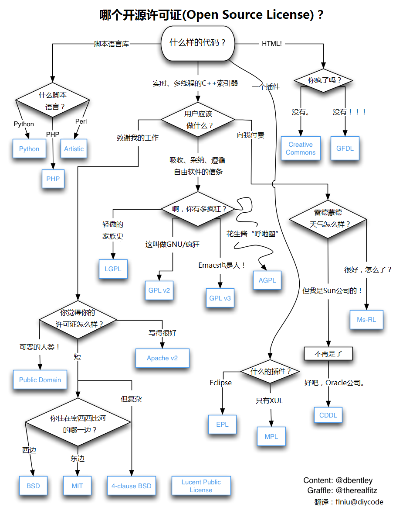

## Go 开源项目示例

---

---

### 如何选择开源协议

### 参考

#### 依赖软件

- [golangci-lint: Fast linters runner for Go](https://github.com/golangci/golangci-lint)
- [govulncheck](https://pkg.go.dev/golang.org/x/vuln/cmd/govulncheck)

#### 开源协议

- [如何选择开源许可证？](https://www.ruanyifeng.com/blog/2011/05/how_to_choose_free_software_licenses.html)